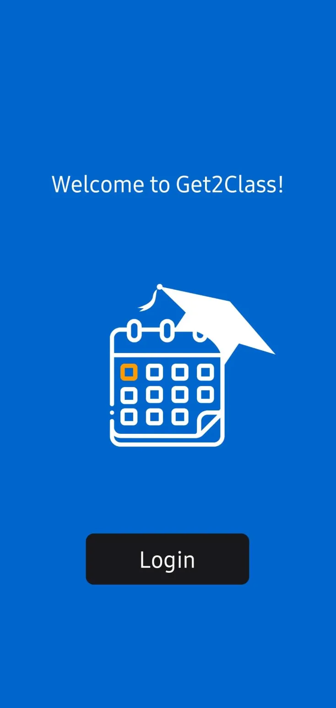
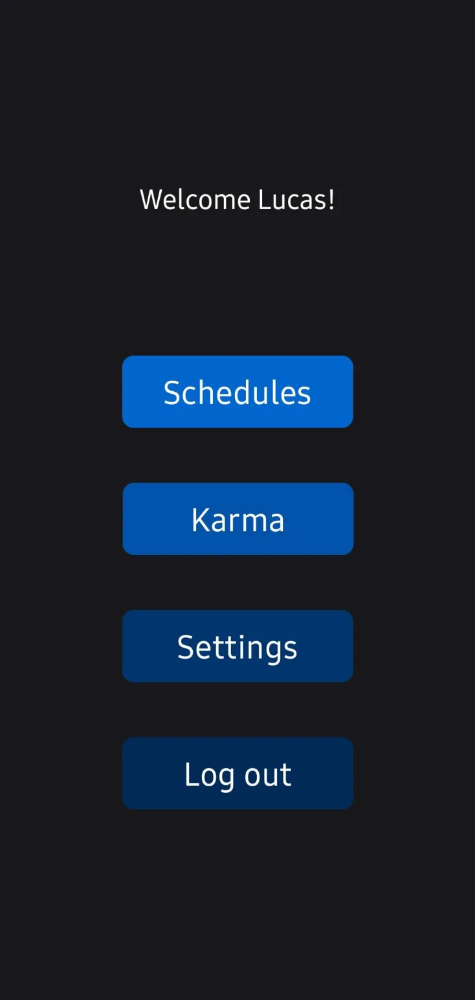
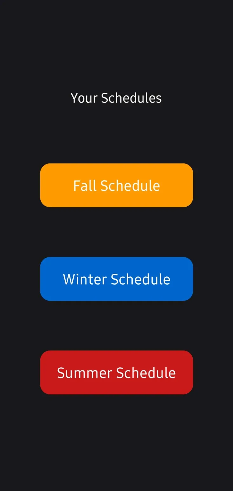
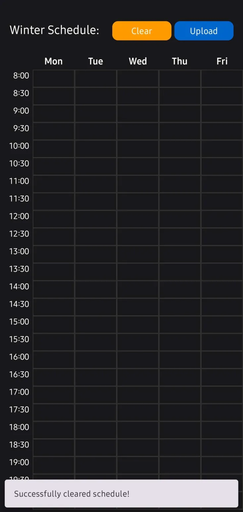
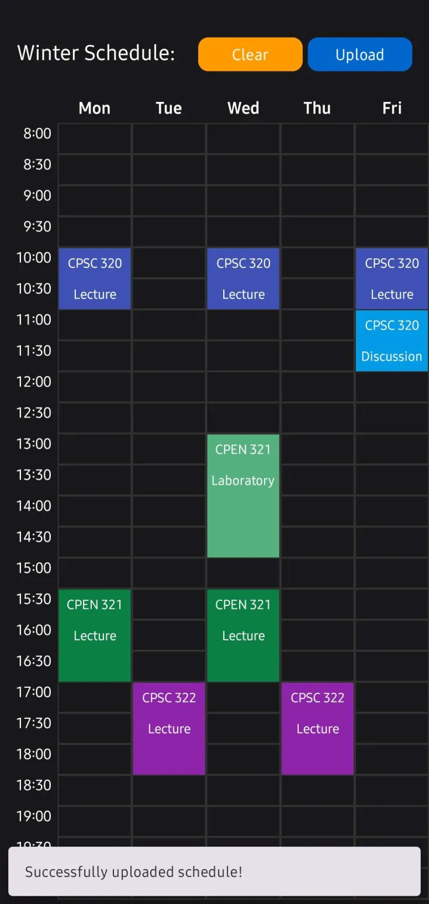
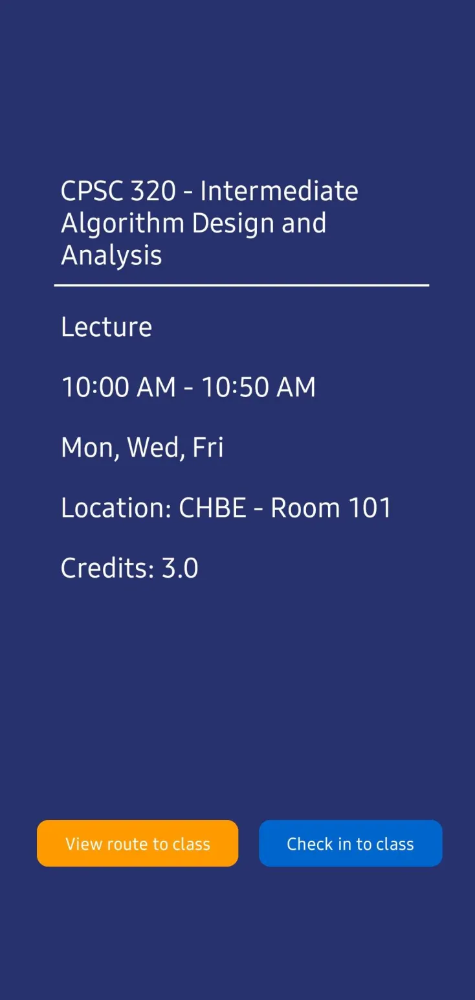
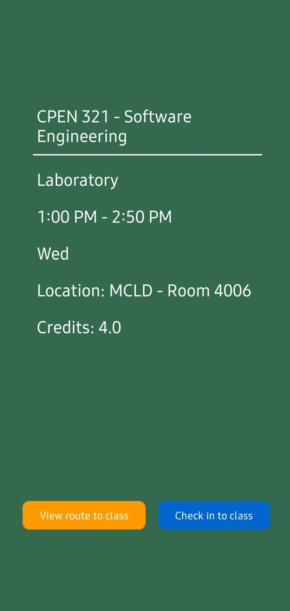
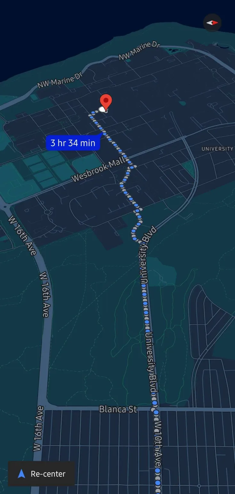
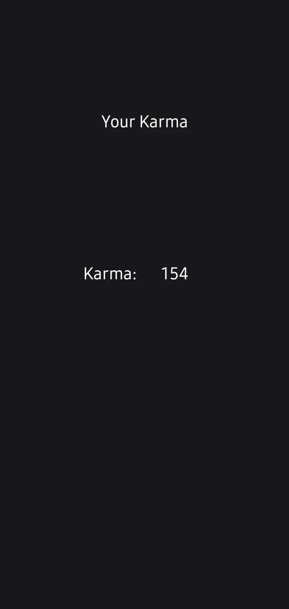
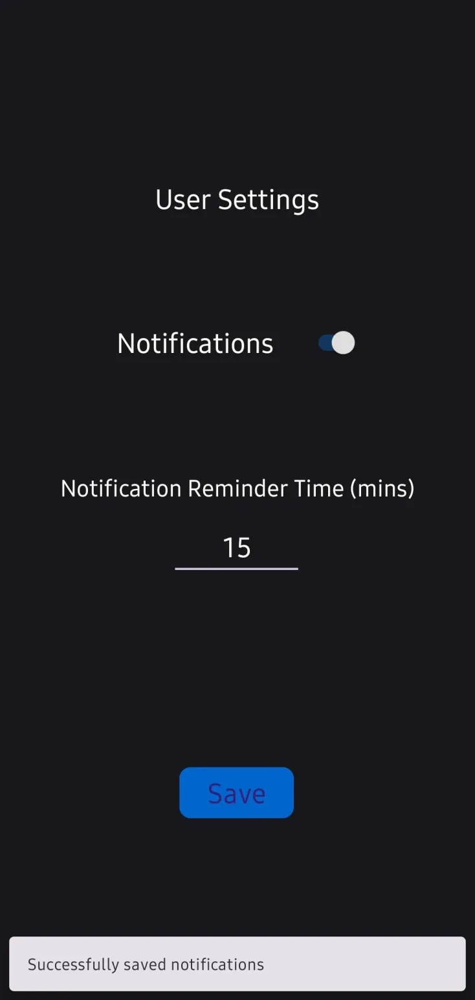

# UBC CPEN 321 Project: Get2Class 

## Group Members
- Lucas Beitel
- Luke Matson
- Yuanyan Hardy Huang
- Trevor Dang

## Introduction
Get2Class is a gamified calendar app designed for university students that rewards punctuality with points, streaks, and real-life incentives-turning the challenge of getting to class on time into a fun, rewarding habit.

Here is a gallery of how the application looks like:

  

    

 

## Inspiration
With the transition from UBC's student service centre website to Workday, the schedule and class viewer have become more unclear, unorganized, and less accessible for students. Additionally, with some students struggling to find their classes due to UBC's large campus, we were inspired to create Get2Class to help address these problems in an entertaining manner. With traditional calendar apps, we felt that they were static and impersonal, so we wanted to build a calendar-like application that was more engaging and student-focused. By combining a calendar-like environment with gamification, Get2Class provides a fun and accessible way for students to view their schedules, navigate to their classes, and check into classes providing them points based on their punctuality. Our goal is to encourage better attendance and a more positive academic experience.

## What it does
Get2Class allows students to export a specific term schedules from Workday (as an excel file) then import them to the schedule viewer in the Get2Class application. Additionally, students will be able view their schedules in an accessible manner, check into their classes, and view the route to their classes. Get2Class provides students additional features to view their karma (points) and manage their notification settings.

## How we built it
We built Get2Class by using Kotlin for the front end, NodeJS and ExpressJS for the back end, and MongoDB for our database. Additionally, for our back end server hosting, we utilized the Amazon Web Services (AWS) cloud platform microservices such as EC2 and API Gateway along with Docker to containerize our back end and database. This allowed our application APK to communicate with an always-on server using HTTPS.

Related to our development workflow, we adopted an agile methodolgy where we had 3-4 meetings per week and discussed features we were working on and plans on how we would complete certain milestones. We used pull requests to help review each others' code and integrated GitHub Actions and Codacy to help ensure the code we were pushing to our main branch would be issue-free and deployable to the AWS cloud.

## Challenges we ran into
One technical challenge in particular we struggled with was during the design and development process for the core functionality of Get2Class which was creating a checking process to allow student's to check into their classes while maintaining integrity for the point system. For example, we needed to develop a checkin system which only allowed student's to check into their classes only when they were on time, in the right location, and haven't already checked into the class they are attending. We did this by utilizing the haversine distance algorithm to calculate the distance between a student's device and the location of the class while performing additional checks to ensure that the date and time aligns with the correct term that the class was in. Finally, to ensure that students could not check into class multiple times and gain points, we created an attendance system which recorded the attendance of students whenever they checked in and prevented them from checking in again. Additionally, we created a post-attendance system (using a cron-scheduler) which would reset the attendance of all students within the database and deduct the points of students for classes that they missed.

## Accomplishments that we're proud of
We are proud of creating a project that is fully functioning and works as we expected from what we had planned from our requirements and design document. Additionally, we were able to achieve 2nd place out of 18 groups within the class (CPEN 321 2024W).

## What we learned
We learned what the entire development cycle of an application looks like and what a software engineer's role in that process is. Some of the responsibilities of a software engineer in the cycle during the planning stages were defining requirements such as actors, use cases, functional requirements, non-functional requirements, and creating diagrams to help plan out what we would build and how we would do it. Additionally, during the design and testing phases, we learned and followed a test-last approach where we implemented new functionality, wrote tests, then reiterated through this process for existing and new features.

## Built with
Kotlin, NodeJS, ExpressJS, MongoDB, AWS, EC2, API Gateway, Docker, Github Actions

## Miscellaneous

### Directory Descriptions:
- `./backend`
    - Contains all of our back end code related to our API routes and integration tests
- `./frontend`
    - Contains all of our front end code related to the different pages of the application and end-to-end tests
- `./documentation`
    - Contains all of our requirements and design and testing documents
- `./gallery`
    - Contains all images related to the application

### Project Setup Instructions:
1. Visit `backend` directory of project and follow the instructions listed
2. Visit `frontend` directory of project and follow the instructions listed
3. Run the `backend` first, then run the `frontend` Android application
