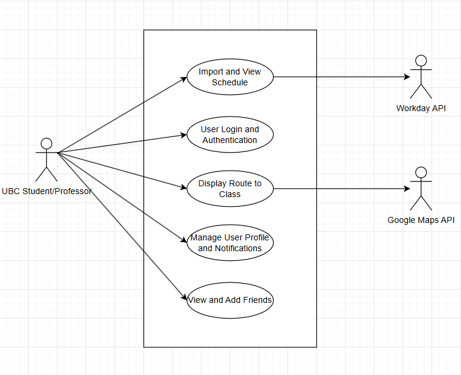

# M3 - Requirements and Design

## 1. Change History
<!-- Leave blank for M3 -->

## 2. Project Description
Get2Class is a gamified calendar to help students get to class on time. The main target audience for this app will be UBC students and professors. The main problem we are trying to solve is simplifying the Workday Student calendar as it is unintuitive and difficult to use. We will make it easy to set up your calendar using data from Workday. It can be difficult, especially for first-year’s, to find your classes using the building acronym on Workday. We will provide maps and walking routes. Additionally, we want to help motivate students to be punctual and attend their classes. Our application aims to solve this by implementing a notification and points system that helps and motivates users to go to classes and provides best routes to reach their next class.

## 3. Requirements Specification
### **3.1. Use-Case Diagram**


### **3.2. Actors Description**
1. **User**: The User is a student/professor which utilizes the application to help get them to their next class.
2. **Workday API**: The Workday API is the actor which will integrate the user's course schedule into the app. Additionally, this API will be utilized by the "Import and View Schedule" use case.
3. **Google Maps API**: The Google Maps API is the actor which will display locations and routes for the user. Additionally, this API will be utilized by the "Display Route to Class" use case.

### **3.3. Functional Requirements**
<a name="fr1"></a>

1. **User Login and Authentication** 
    - **Overview**:
        1. Sign In to Account: System will allow user to utilize external authentication to login to the app 
    
    - **Detailed Flow for Each Independent Scenario**: 
        1. **Sign In to Account**:
            - **Description**: The user will utilize an external authentication API such as Google Signin API to log themselves into the app as a user.
            - **Primary actor(s)**: User (Student/Professor) 
            - **Main success scenario**:
                1. Use will click on the Google Signin button
                2. A popup/rerouting of the page will occur providing the user a screen to enter their Google credentials
                3. Once the user hits the Login button they will then be routed to the home page of the application
            - **Failure scenario(s)**:
                - 2a. 
                    - 2a1. ...
                    - 2a2. ...

        2. ...
    
2. **Import and View Schedule**
    - **Overview**:
        1. Create Schedule: The system must allow the user to generate a blank schedule
        2. Update Schedule: The system must allow the user to import their schedule from Workday
        3. View Schedule: The system must allow the user to view their schedule in a clear and understandable format
        4. Delete Schedule: The system must allow the user to delete an existing schedule
    
    - **Detailed Flow for Each Independent Scenario**:
        1. **Create Schedule**:
        2. **Update Schedule**:
        3. **View Schedule**:
        4. **Delete Schedule**:

3. **Display Route to Class**
    - **Overview**:
        1. View Route: The system must display to the user a route to their next class
    
    - **Detailed Flow for Each Independent Scenario**:
        1. **View Route**:

4. **Manage User Profile and Notifications**
    - **Overview**:
        1. View Profile and Settings: The system must allow the user to view their profile and settings
        2. Update Notifications: The system must allow the user to manage their notification settings

    - **Detailed Flow for Each Independent Scenario**:
        1. **View Profile and Settings**:
            - **Description**:
            - **Primary Actor(s)**:
            - **Main success scenario**:
                1. ...
                2. ...
            - **Failure scenario(s)**:
                - 1a. ...
                    - 1a1. ...
                    - 1a2. ...
        2. **Update Notifications**:
            - **Description**:
            - **Primary Actor(s)**:
            - **Main success scenario**:
                1. ...
                2. ...
            - **Failure scenario(s)**:
                - 1a. ...
                    - 1a1. ...
                    - 1a2. ...

5. **View and Add Friends**
    - **Overview**:
        1. View Friends: The system must allow the user to view the friends they have added 
        2. Add Friends: The system must allow the user to add friends
        3. Delete Friends: The system must allow the user to delete friends
    
    - **Detailed Flow for Each Independent Scenario**:
        1. **View Friends**:
            - **Description**:
            - **Primary Actor(s)**: ...
            - **Main success scenario**:
                1. ...
                2. ...
            - **Failure scenario(s)**:
                - 1a. ...
                    - 1a1. ...
                    - 1a2. ...
        2. **Add Friends**:
        3. **Delete Friends**:


### **3.4. Screen Mockups**


### **3.5. Non-Functional Requirements**
<a name="nfr1"></a>

1. **[WRITE_NAME_HERE]**
    - **Description**: ...
    - **Justification**: ...
2. ...


## 4. Designs Specification
### **4.1. Main Components**
1. **[WRITE_NAME_HERE]**
    - **Purpose**: ...
    - **Interfaces**: 
        1. ...
            - **Purpose**: ...
        2. ...
2. ...


### **4.2. Databases**
1. **[WRITE_NAME_HERE]**
    - **Purpose**: ...
2. ...


### **4.3. External Modules**
1. **[WRITE_NAME_HERE]** 
    - **Purpose**: ...
2. ...


### **4.4. Frameworks**
1. **[WRITE_NAME_HERE]**
    - **Purpose**: ...
    - **Reason**: ...
2. ...


### **4.5. Dependencies Diagram**


### **4.6. Functional Requirements Sequence Diagram**
1. [**[WRITE_NAME_HERE]**](#fr1)\
[SEQUENCE_DIAGRAM_HERE]
2. ...


### **4.7. Non-Functional Requirements Design**
1. [**[WRITE_NAME_HERE]**](#nfr1)
    - **Validation**: ...
2. ...


### **4.8. Main Project Complexity Design**
**[WRITE_NAME_HERE]**
- **Description**: ...
- **Why complex?**: ...
- **Design**:
    - **Input**: ...
    - **Output**: ...
    - **Main computational logic**: ...
    - **Pseudo-code**: ...
        ```
        
        ```


## 5. Contributions
- ...
- ...
- ...
- ...