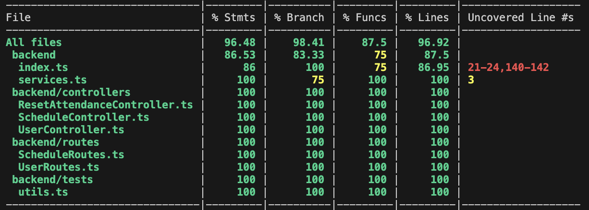
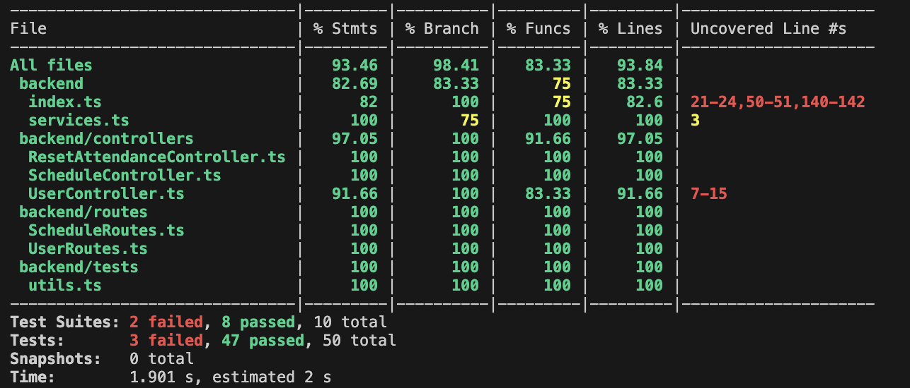
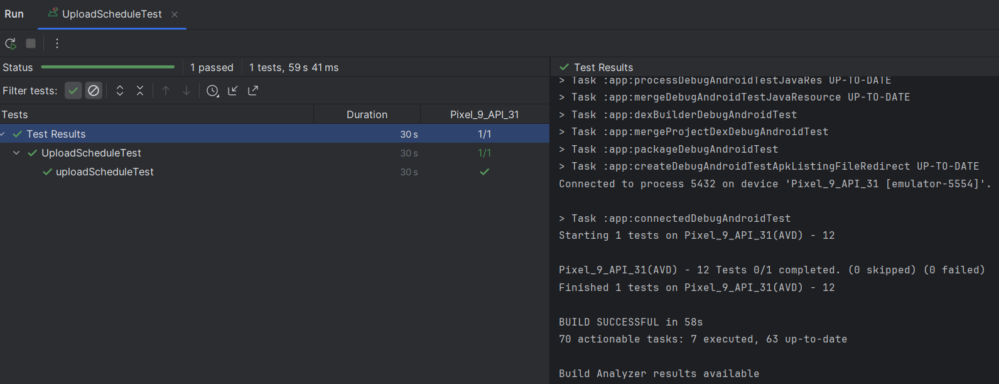
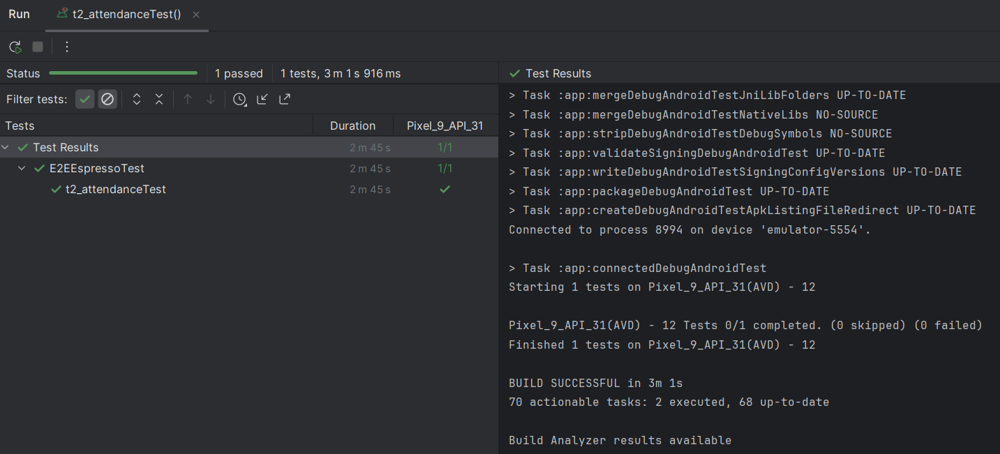
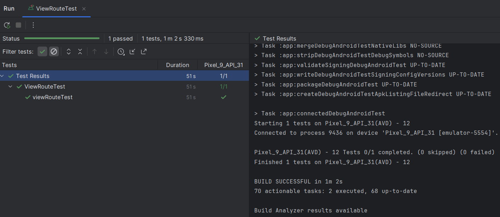
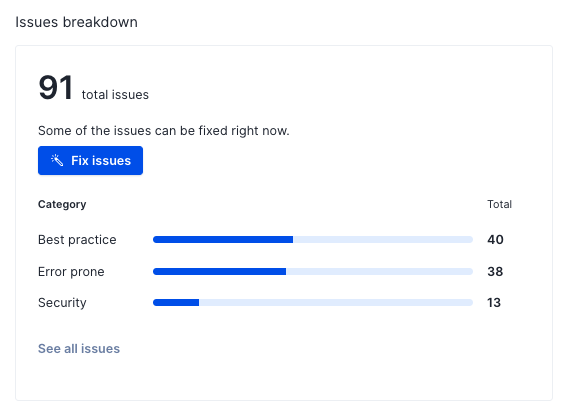
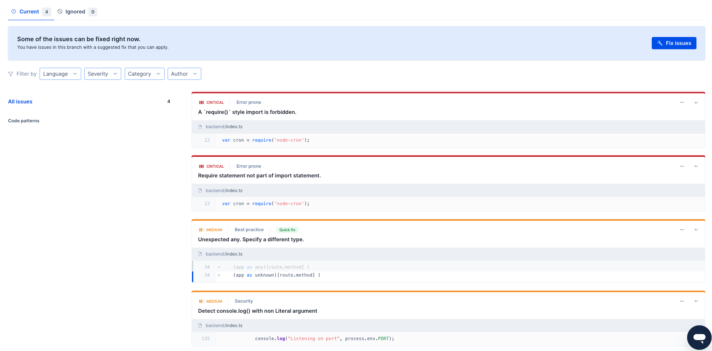

# Example M5: Testing and Code Review

## 1. Change History

| **Change Date**   | **Modified Sections** | **Rationale** |
| ----------------- | --------------------- | ------------- |
| _Nothing to show_ |

---

## 2. Back-end Test Specification: APIs

### 2.1. Locations of Back-end Tests and Instructions to Run Them

#### 2.1.1. Tests

| **Interface**               | **Describe Group Location, No Mocks**                | **Describe Group Location, With Mocks**            | **Mocked Components**              |
| ----------------------------- | ---------------------------------------------------- | -------------------------------------------------- | ---------------------------------- |
| **POST /user** | [`backend/tests/unmocked_tests/CreateUser.test.ts#L24`](#) | [`backend/tests/mocked_tests/CreateUser.test.ts#L24`](#) | Database client |
| **GET /user** | [`backend/tests/unmocked_tests/GetUser.test.ts#L30`](#) | [`backend/tests/mocked_tests/GetUser.test.ts#L31`](#) | Database client |
| **POST /tokensignin** | [`NA`](#) | [`backend/tests/mocked_tests/GoogleSignIn.test.ts#L26`](#) | Google-Authenticator |
| **PUT /karma** | [`backend/tests/unmocked_tests/UpdateKarma.test.ts#L30`](#) | [`backend/tests/mocked_tests/UpdateKarma.test.ts#L30`](#) | Database client |
| **GET /notification_settings** | [`backend/tests/unmocked_tests/UserNotification.test.ts#L30`](#) | [`backend/tests/mocked_tests/UserNotification.test.ts#L30`](#) | Database client |
| **PUT /notification_settings** | [`backend/tests/unmocked_tests/UserNotification.test.ts#L79`](#) | [`backend/tests/mocked_tests/UserNotification.test.ts#L78`](#) | Database client |
| **DELETE /schedule** | [`backend/tests/unmocked_tests/DeleteSchedule.test.ts#L26`](#) | [`backend/tests/mocked_tests/DeleteSchedule.test.ts#L28`](#) | Database client |
| **GET /attendance** | [`backend/tests/unmocked_tests/GetAttendance.test.ts#L27`](#) | [`backend/tests/mocked_tests/GetAttendance.test.ts#L27`](#) | Database client |
| **GET /schedule** | [`backend/tests/unmocked_tests/GetSchedule.test.ts#L27`](#) | [`backend/tests/mocked_tests/GetSchedule.test.ts#L27`](#) | Database client |
| **PUT /attendance** | [`backend/tests/unmocked_tests/PutAttendance.test.ts#L33`](#) | [`backend/tests/mocked_tests/PutAttendance.test.ts#L30`](#) | Database client |
| **PUT /schedule** | [`backend/tests/unmocked_tests/PutSchedule.test.ts#L25`](#) | [`backend/tests/mocked_tests/PutSchedule.test.ts#L34`](#) | Database client |

#### 2.1.2. Commit Hash Where Tests Run

`[Insert Commit SHA here]`

#### 2.1.3. Explanation on How to Run the Tests

1. **Clone the Repository**:

  - Open your terminal and run:
    ```
    git clone https://github.com/example/your-project.git
    ```

2. **Checkout to `milestone-5` branch**:

  - In the terminal, after you have cloned the repository, checkout to `milestone-5` branch with the following command:
    ```
    git checkout milestone-5
    ```

3. **Change Directory to `backend`**:
  
  - In the terminal you will change directory to `backend`:
    ```
    cd backend
    ```

4. **Install Dependencies**:

  - In the terminal you will run install the dependencies by making sure you are in the `backend` directory and you run:
    ```
    npm i
    ```

5. **Running the Tests**:
  - In the terminal you will change directory to `tests` where the mocked and unmocked tests are located:
    ```
    cd tests
    npm test
    ```

6. **You can run the mocked and unmocked tests with the following commands below (Optional)**:
  - In the terminal, make you sure you're in the `tests` directory:
    - For `unmocked_tests`:
      ```
      npm test ./unmocked_tests/
      ```
    - For `mocked_tests`:
      ```
      npm test ./mocked_tests/
      ```

### 2.2. GitHub Actions Configuration Location

`~/.github/workflows/backend-tests.yml`

### 2.3. Jest Coverage Report Screenshots With Mocks



- #### Reason for uncovered lines in `index.ts`
  - These lines have to do with Promise errors within the try-catches of the routes and scheduler which do not get triggered as they are part of the server set up logic.

- #### Reason for uncovered lines in `services.ts`
  - This is part of the back end tutorial and has to deal with the MongoDB Client set up logic.

### 2.4. Jest Coverage Report Screenshots Without Mocks



- #### Reason for uncovered lines in `UserController.ts`
  - This is the `/tokensignin` route which mocks the Google OAuth2Client which gets handled within the mocked_tests

- #### Reason for uncovered lines in `index.ts` specifically L50 - L51
  - This gets handled by the mocked_tests in section 2.3

---

## 3. Tests of Non-Functional Requirements

### 3.1. Test Locations in Git

| **Non-Functional Requirement**  | **Location in Git**                              |
| ------------------------------- | ----------------------------- |
| **Schedule Upload Time** | [`frontend/app/src/androidTest/java/com/example/get2class/ExampleInstrumentedTest.kt#L84`](#) |
| **Attendance Check Time** | [`frontend/app/src/androidTest/java/com/example/get2class/ExampleInstrumentedTest.kt#L172`](#) |

We directly integrated these tests into our frontend tests.<br>Instructions for running them can be found in section 4.1.

### 3.2. Test Verification and Logs

- **Schedule Usability**

  - **Verification:** This test simulates a user uploading their schedule from an xlsx file in their phone's downloads. The focus is on ensuring that the process of uploading the file, parsing it, storing it on the database, and rendering it for the user completes within the target response time of 4 seconds under normal load. We use Espresso's onView().check() to ensure the timer does not stop until the component is displayed for the user. We use Espresso's onView().perform(click()) to ensure the timer does not stop until the component is displayed for the user. The test logs let us know if the system meets our requirement. 
  - **Log Output**
    ```
    Test 1: Successfully upload a winter schedule in 1762ms!
    ```

- **Check-in Usability**
  - **Verification:** This test simulates a user clicking on the "Check in to class" button with the help of Espresso. The focus is to ensure that the process of checking the time and location of the user, checking the starting time and location of the next class, calculating, updating and showing the Karma points the user gains completes within the target response time of 4 seconds under normal load. We use Espresso's onView().perform(click()) and onView().check() to perform the click action and check if the user receives the response from the app. The test logs capture the processing time and let us know if the system meets our requirement.
  - **Log Output**
    ```
    Test 2: Successfully check the user in when they are late and award appropriate amount of points in 481ms!
    ```

---

## 4. Front-end Test Specification

### 4.1. Location in Git of Front-end Test Suite:

`frontend/app/src/androidTest/java/com/example/get2class/ExampleInstrumentedTest.kt`

#### Explanation on How to Run the Tests

1. Read get2class/frontend/README.md to set up the frontend.
2. Make sure the settings app is on your emulated device's home screen.
3. In the device's settings, disable "Set time automatically" and if needed set to the date to March 2025.
4. Turn off Window animation scale, Transition animation scale, and Animator duration scale in the device's developer settings.
5. Copy the file get2class/documentation/View_My_Courses.xlsx to the device's downloads folder without changing its name.
6. Make sure when tapping upload in the app, it opens to the folder containing the file.
7. Open the test in frontend/app/src/androidTest/java/com/example/get2class/ExampleInstrumentedTest.kt.
8. Change the NAME variable to the name that shows up when you sign in with Google
9. Run the test. If it fails due to emulator lag, manually upload and clear a schedule the rerun the test. 


### 4.2. Tests

- **Use Case: Upload Schedule**

  - **Expected Behaviors:**
    | **Scenario Steps** | **Test Case Steps** |
    | ------------------ | ------------------- |
    | 1. The user chooses which schedule they want to set (Fall, Winter, Summer). | Log in and navigate to the schedule. |
    | 2. The user will then click on the Upload Schedule button. | Click on the button with ID upload_schedule_button. |
    | 4. A page reroute will occur requesting the user to upload the .xlsx file they got from Workday. | Click on the file titled "View_My_Courses.xlsx". |
    | 4a. The schedule was not for this term. | Check none of the classes were uploaded. |
    | 4a1. The user received a toast telling them to upload it to the correct term. | Check that the message is visible. |
    | 5. The schedule was properly uploaded. | Check that the classes display the right number of lectures, labs, and discussions. <br>Check classes without a meeting time are not displayed. |

  - **Test Logs:**
    

- **Use Case: Check Attendance**

  - **Expected Behaviors:**

    | **Scenario Steps** | **Test Case Steps** |
    | ------------------ | ------------------- |
    | 1. User clicks on the "Check in to class" button. | Log in and navigate to the class's info page. <br>Click on the button with ID check_attendance_button. |
    | 2. The user receives a toast telling them they got 60 Karma.<br>Note that for technical reasons, in the script this scenario is tested between 2e and 2f. | Change the phone's time to 9:55 AM<br>Click on the button with ID check_attendance_button.<br> Check that the message is visible. |
    | 2a. The class is not from this year. | Change the phone's year to 2024.<br>Click on the button with ID check_attendance_button. |
    | 2a1. The user receives a toast explaining the error. | Check that the message is visible. |
    | 2b. The class is not from this term. | Change the phone's month to May 2025.<br>Click on the button with ID check_attendance_button. |
    | 2b1. The user receives a toast explaining the error. | Check that the message is visible. |
    | 2c. The class is not on this day of the week. | Change the phone's day to Tuesday, March 4.<br>Click on the button with ID check_attendance_button. |
    | 2c1. The user receives a toast explaining the error. | Check that the message is visible. |
    | 2d. It's too early in the day to check in to the class. | Change the phone's day to Monday, March 10.<br>Change the phone's time to 9:45 AM<br>Click on the button with ID check_attendance_button. |
    | 2d1. The user receives a toast explaining the error. | Check that the message is visible. |
    | 2e. It's too late in the day to check in to the class. | Change the phone's time to 10:55 AM<br>Click on the button with ID check_attendance_button. |
    | 2e1. The user receives a toast explaining the error. | Check that the message is visible. |
    | 2f. The user already checked into class today. | Click on the button with ID check_attendance_button. |
    | 2f1. The user receives a toast explaining the error. | Check that the message is visible. |
    | 2g. The user went to class, but they were not on time. | Navigate to a different class.<br>Change the phone's time to 3:55 PM<br>Click on the button with ID check_attendance_button. |
    | 2g1. The user receives a toast telling them how late they were.<br>The user receives a toast telling them how much Karma they gained. | Check that the message is visible with the right amount of Karma. |
    | 2h. The user is in the wrong location. | Navigate to a different class.<br>Change the phone's time to 4:55 PM<br>Click on the button with ID check_attendance_button. |
    | 2h1. The user receives a toast explaining the error. | Check that the message is visible. |

  - **Test Logs:**
    

- **Use Case: View Route To class**

  - **Expected Behaviors:**

    | **Scenario Steps** | **Test Case Steps** |
    | ------------------ | ------------------- |
    | 1. The user clicks on View Route. | Log in and navigate to the class's info page. <br> Click the button labelled "View route to class". |
    | 2. The app prompts the user to grant location permissions if not already granted. | Check if "While using the app" option from the permission request dialog is present on the screen. |
    | 2a. The user does not grant location permissions. | Click the option labelled "Don’t allow" in the dialog. |
    | 2a1. If the user denies, the app shows a toast to tell the user to enable location permissions in the settings first. | Check if the text "Please grant Location permissions in Settings to view your routes :/" is present on the screen. |
    | 2a2. The app routes the user back to the previous screen. | Check if the buttons labelled "View route to class" and "Check in to class" are present on the screen. |
    | 3. The user sees their current location and destination location together with the optimal route on the screen. | Check if the navigation layout is present on the screen. <br> Swipe the screen up and then to the right. <br> Check if the button labelled "Re-center" is present on the screen. <br> Click the button labelled "Re-center". |

  - **Test Logs:**
    

---

## 5. Automated Code Review Results

### 5.1. Commit Hash Where Codacy Ran

`[Insert Commit SHA here]`

### 5.2. Unfixed Issues per Codacy Category



- #### Notice:
  - It says there are 91 total issues, but this might be for the `main` branch and not our `milestone-5` branch. However, if you refer to section 5.3 this is a more reflective amount of our issues which we will justify why they are not fixed in Section 5.4.

### 5.3. Unfixed Issues per Codacy Code Pattern



### 5.4. Justifications for Unfixed Issues

- **Code Pattern: [A `require()` style import is forbidden](#)**

  1. **Issue**

     - **Location in Git:** [`backend/index.ts#L12`](#)
     - **Justification:** Referring to the node-cron npm docs (https://www.npmjs.com/package/node-cron), they mention to use `var cron = require('node-cron')` to utilize the scheduler function

- **Code Pattern: [Require statement not part of import statement](#)**

  1. **Issue**

    - **Location in Git:** [`backend/index.ts#L12`](#)
    - **Justification:** Referring to the node-cron npm docs (https://www.npmjs.com/package/node-cron), they mention to use `var cron = require('node-cron')` to utilize the scheduler function

- **Code Pattern: [Unexpected any. Specify a different type](#)**

  1. **Issue**

    - **Location in Git:** [`backend/index.ts#L34`](#)
    - **Justification:** From the CPEN 321 Backend Tutorials provided by the TAs. Specifically in Backend Tutorial Video 3, at 26:52, it is shown that the `app as any` is being used for the TodoRoutes

  2. **Issue**

    - **Location in Git:** [`backend/index.ts#L61`](#)
    - **Justification:** From the CPEN 321 Backend Tutorials provided by the TAs. Specifically in Backend Tutorial Video 3, at 26:52, it is shown that the `app as any` is being used for the TodoRoutes

- **Code Pattern: [Detect console.log() with non Literal argument](#)**

  1. **Issue**

    - **Location in Git:** [`backend/index.ts#L135`](#)
    - **Justification:** From the CPEN 321 Backend Tutorials provided by the TAs. Specifically in Backend Tutorial Video 4, at 18:00, it is shown that the `console.log("Listening on port " + process.env.PORT)` is being used to show the port number of the server